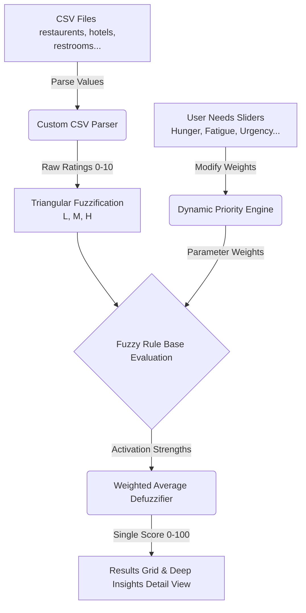
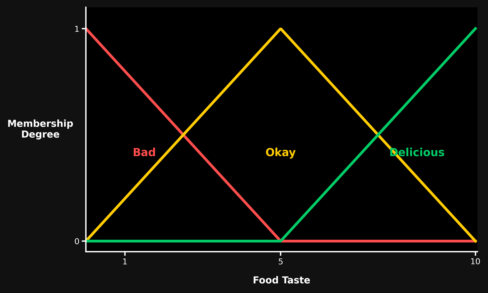

# 🇨🇭 Switzerland Travel Amenities Platform
### *An Interactive Zero-Order Sugeno Fuzzy Inference System with Dynamic Context-Priority Scaling*

[](LICENSE)
[](#)
[](#)

---

## 📖 Table of Contents
1. [Overview](#-overview)
2. [Key Features](#-key-features)
3. [Architecture & Workflow](#-architecture--workflow)
4. [Mathematical Engine Details](#-mathematical-engine-details)
   - [Step 1: Fuzzification (Triangular Membership)](#step-1-fuzzification-triangular-membership)
   - [Step 2: Dynamic Priority Engine](#step-2-dynamic-priority-engine)
   - [Step 3: Rule Evaluation](#step-3-rule-evaluation)
   - [Step 4: Defuzzification (Weighted Average)](#step-4-defuzzification-weighted-average)
5. [Data Schema (CSV Structure)](#-data-schema-csv-structure)
6. [Project Structure](#-project-structure)
7. [Getting Started & Local Execution](#-getting-started--local-execution)
8. [Automated Scripts & Utilities](#-automated-scripts--utilities)
9. [Cross-Validation & Testing](#-cross-validation--testing)

---

## 🔍 Overview
The **Switzerland Travel Amenities Platform** is a web-based decision support system designed to help travelers find and compare key amenities (restaurants, hotels, convenience stores, restrooms, and pharmacies) across six major Swiss cities: **Bern, Basel, Zurich, Geneva, Lausanne, and Lucerne**.

Instead of relying on rigid, one-size-fits-all scoring systems, the platform utilizes a **Zero-Order Sugeno (Takagi-Sugeno-Kang) Fuzzy Inference System (FIS)**. This engine dynamically evaluates real-time physical states of the traveler (e.g., Hunger, Fatigue, Restroom Urgency) and translates complex multi-criteria inputs into a single, intuitive sustainability score and linguistic rating (from *Very Bad* to *Excellent*).

---

## ✨ Key Features
- **Zero-Order Sugeno Fuzzy Engine:** Implements customized rulesets for 5 different categories, utilizing the MIN operator for condition intersections.
- **Dynamic Context Priority Scaling:** Translates user needs (sliders) into parameter-weight modifiers (e.g., higher fatigue automatically scales the weight of proximity/distance).
- **Deep Insights Inspector:** Offers full mathematical transparency. Users can view the exact fuzzified values, triggered rules, and the final defuzzification equation in real time.
- **Modern Vanilla UI:** A responsive, light/dark-mode compatible layout featuring glassmorphism, responsive grids, and modern typographic hierarchies (using *Plus Jakarta Sans* and *Space Grotesk*).
- **Custom CSV Loader:** Built-in client-side CSV parser that processes datasets on-the-fly and falls back onto hardcoded embedded objects in case of fetch failures.

---

## 🛠 Architecture & Workflow

Here is how data flows through the application:



---

## 🧮 Mathematical Engine Details

### Step 1: Fuzzification (Triangular Membership)
For any input metric $v \in [0, 10]$, the system maps it to three overlapping linguistic terms: **Low (L)**, **Medium (M)**, and **High (H)** using symmetric triangular membership equations:

$$\mu_L(v) = \max\left(0, 1 - \frac{|v - 0|}{5}\right)$$
$$\mu_M(v) = \max\left(0, 1 - \frac{|v - 5|}{5}\right)$$
$$\mu_H(v) = \max\left(0, 1 - \frac{|v - 10|}{5}\right)$$

Below is a representation of the triangular membership shapes centered at $0$, $5$, and $10$:



### Step 2: Dynamic Priority Engine
User sliders (0 to 10 scale) dynamically intercept the base category weights:
- **Hunger:** Modulates `Taste` and `Quality` in Restaurants, and `Availability` in Stores.
- **Fatigue:** Modulates `Distance` globally and `Amenities` in Hotels.
- **Restroom Urgency:** Modulates `Distance` and `Waiting Time` for Restrooms.
- **Hygiene Preference:** Modulates `Cleanliness` and `Service Quality`.
- **Budget Sensitivity:** Modulates `Cost` / `Price`.

The weights are then normalized to ensure that $\sum w_i = 1.0$, preserving fair parameter competition.

### Step 3: Rule Evaluation
Rules are structured as:
$$\text{IF Taste} = H \text{ AND Quality} = H \rightarrow 95$$

For each rule $r$, the base activation strength $\alpha_{base}$ is computed using the **MIN operator** (intersection):
$$\alpha_{base} = \min(\mu_{Taste, H}, \mu_{Quality, H})$$

The final rule strength is modulated by the dynamic weights of the parameters involved in the rule:
$$\alpha_{final} = \alpha_{base} \times \sum w_{conditions}$$

### Step 4: Defuzzification (Weighted Average)
The crisp final score is aggregated from all active rules using the weighted average method:
$$\text{Final Score} = \frac{\sum_r (\alpha_{final, r} \times C_r)}{\sum_r \alpha_{final, r}}$$
where $C_r$ is the constant output value of rule $r$ (e.g., $95$). This score is then mapped back to a linguistic label:
- **0–20:** Very Bad 🔴
- **21–40:** Bad 🟠
- **41–60:** Average 🟡
- **61–75:** Good 🟢
- **76–90:** Very Good 🔵
- **91–100:** Excellent 🌟

---

## 📊 Data Schema (CSV Structure)
The application expects comma-separated files located in the root directory.

### Restaurants (`restaurents.csv`)
Headers: `name`, `adress`, `distance_km`, `Distance`, `Cost`, `Quality`, `Taste`, `Ambience`, `Links`

### Hotels (`hotels.csv`)
Headers: `name`, `adress`, `distance_km`, `Price per Night`, `Distance`, `Cleanliness`, `Safety`, `Amenities`, `Links`

### Convenience Stores (`stores.csv`)
Headers: `name`, `adress`, `distance_km`, `Distance`, `price level`, `Availability`, `crowd`, `service speed`, `Links`

### Restrooms (`restrooms.csv`)
Headers: `name`, `adress`, `distance_km`, `Distance`, `cleanliness`, `safety`, `waiting time`, `accessibility`, `Links`

### Pharmacies (`pharmacies.csv`)
Headers: `name`, `adress`, `distance_km`, `Distance`, `medicine availability`, `waiting time`, `service quality`, `emergency availability`, `Links`

> [!NOTE]
> The raw data files utilize `adress` (with a single 'd') for physical addresses, and `Links` for Google Maps coordinates links. The parser dynamically handles casing and fallback to standard headings.

---

## 📂 Project Structure
```
├── index.html               # Main entry point & app-shell layout
├── styles.css               # Styling definitions (glassmorphism, typography, colors)
├── app.js                   # Client-side router, CSV loader & template engine
├── fuzzy.js                 # Sugeno Fuzzy Logic & Priority Weight Engine
├── data.js                  # Preloaded embedded fallback dataset object
├── *.csv                    # Real-world Swiss travel datasets (Bern live records)
├── *.pptx                   # Academic presentations (original and final slide decks)
├── patch_rules.py           # Python script to modify and compile rules inside fuzzy.js
├── update_ppt.py            # Python script to automate PowerPoint slide deck updates
├── simulate.js              # Mock-DOM utility to test system flows under Node.js
└── LICENSE                  # MIT License details
```

---

## 🚀 Getting Started & Local Execution

### 1. Run in the Browser
Since the platform is built with standard HTML5, CSS3, and Vanilla JavaScript, you can run it locally without a complex build pipeline:

**Option A: Using Python's built-in server (Recommended)**
```bash
python3 -m http.server 8000
```
Then visit `http://localhost:8000` in your web browser.

**Option B: Using Node.js `serve`**
```bash
npx serve .
```

### 2. Node.js Environment Simulation
If you want to run simulations inside a Node.js console (for testing/debug scripts), install dependencies and execute `simulate.js`:
```bash
npm install
node simulate.js
```

---

## 🛠 Automated Scripts & Utilities

- **Rule Patches (`patch_rules.py`):** Modifies `fuzzy.js` configs automatically. Use it to adjust rule consequences or update rule definitions directly using Python.
- **PowerPoint Updates (`update_ppt.py` / `read_ppt.py`):** Useful for academic reporting. It reads slide content, performs substitutions, and inserts a custom slide describing the *Dynamic Context Priority Engine*. Requires `python-pptx`:
  ```bash
  pip install python-pptx
  python3 update_ppt.py
  ```
- **Cross-Validation (`cross_validation.js`):** Runs the validation suite that compares the fuzzy logic outputs against human-intuitive bounds across multiple test profiles.
  ```bash
  node cross_validation.js
  ```

---

## 🧪 Cross-Validation & Testing

To verify that the computational outputs of our Fuzzy Inference System align with human intuition, the platform includes a **Cross-Validation Engine** (`cross_validation.js`).

This test suite runs **13 realistic scenario profiles** across all 5 amenity categories (e.g. high-end dining, dirty/unsafe hotels, crowded convenience stores). Because human labels have fuzzy boundaries, each scenario defines a range of acceptable labels (e.g. rating a $9.5/10$ restaurant as either `Very Good` or `Excellent` is humanly intuitive).

To execute the test suite:
```bash
node cross_validation.js
```

### Expected Output Report:
```
=====================================================================
             FUZZY SYSTEM CROSS-VALIDATION ENGINE REPORT              
=====================================================================
Loaded 13 expert test scenarios across 5 categories.
Running evaluation comparison against human-intuitive bounds...

ID  CATEGORY      HUMAN INTUITION RANGE         PREDICTED   SCORE   STATUS    SCENARIO DESCRIPTION
----------------------------------------------------------------------------------------------------------------------------------
1   RESTAURANTS   Very Good OR Excellent        Very Good   85.4    ✅ MATCH   High-end dining with outstanding taste...
2   RESTAURANTS   Bad OR Very Bad               Bad         33.3    ✅ MATCH   Poor food quality, terrible taste...
...
----------------------------------------------------------------------------------------------------------------------------------
Validation Summary: 13/13 matches.
Cross-Validation Label Accuracy: 100.0%
=====================================================================
🎉 SUCCESS: The Fuzzy Engine outputs align 100% with human-intuitive expectations!
=====================================================================
```

